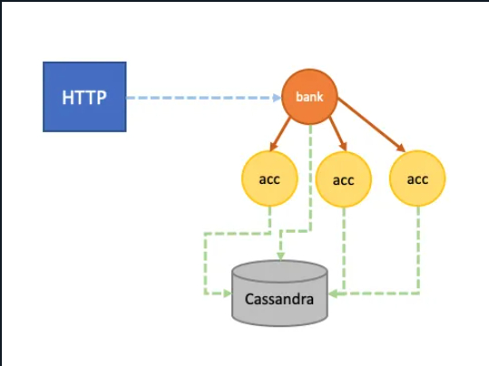

## Scala Akka playground

### The “Architecture”
This is not a production application, but we do have some moving parts.

We’re going to create a mini-bank application which manages people’s bank accounts. We need to support the following operations:

- Creating a bank account
- Retrieving current bank account details
- Depositing/withdrawing money

Using Akka actors and Akka Persistence, the application will work as follows

- Each bank account is a persistent actor
- All events are recorded (creation, update etc.)
- All events are replayed in case of failure/restart
- One big bank (also persistent) actor manages all actors
- An HTTP server with a REST API handles requests from outside
- All events are stored in Cassandra

The “architecture” therefore looks like this:

